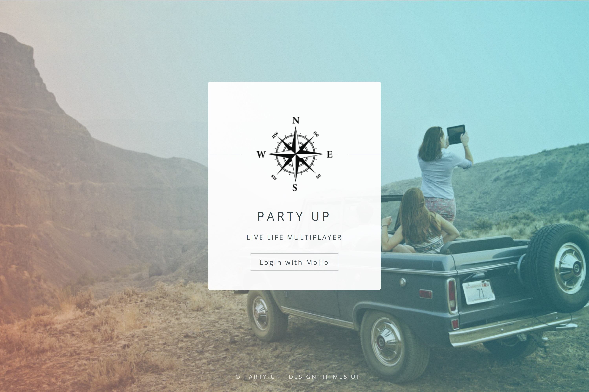

# Party-Up

Party-Up allows you to build groups with people you know to share real-time information when you drive together. Instantly see where your friends are and what's their ETA to arriving at your destination.

## How We Built It

We developed Party-Up with PHP and Laravel, hosted on Amazon Web Services, using a custon built SQL Server Lite database. The primary technology our app utilized was the Mojio connected car platform. We utilized the Mojio platform to simulate receiving real-time information from vehicles, that we plotted using Google Maps on our app.

https://devpost.com/software/party-up-clur9h